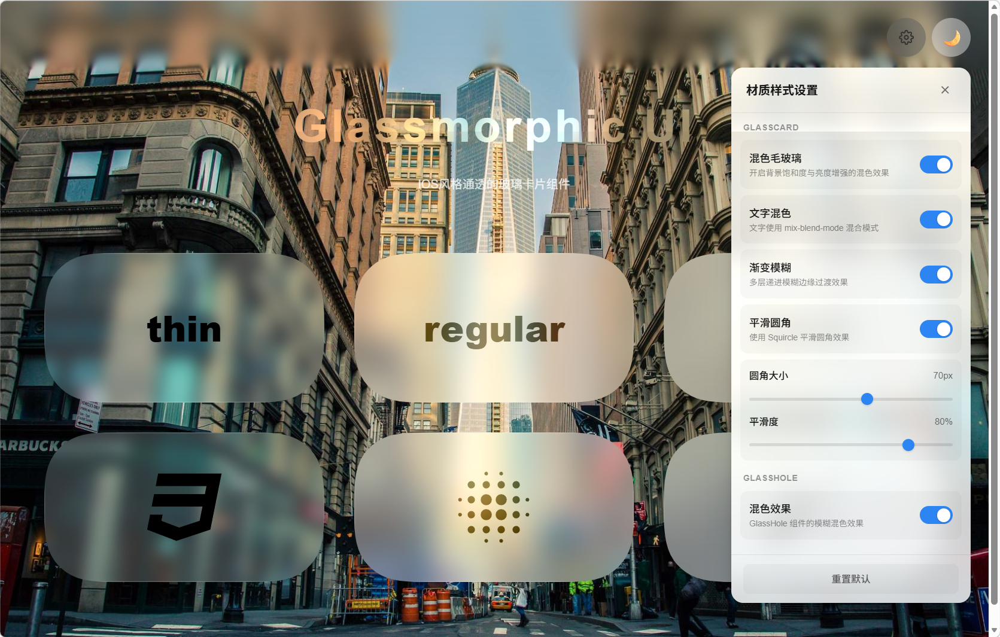
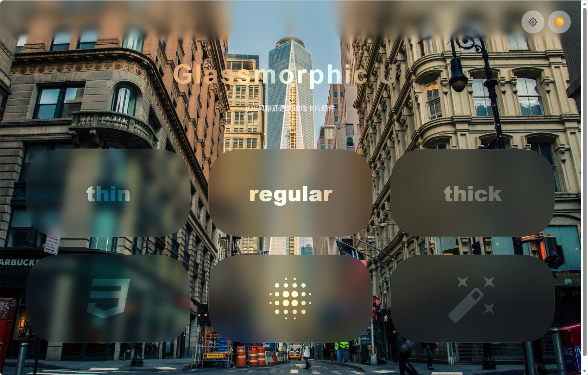
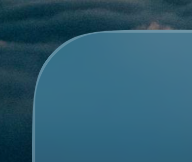
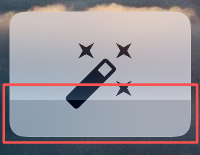

# 🪟 FxxkGlass


一套接近 iOS 风格毛玻璃（非ios26的液态玻璃） UI 组件，支持渐进式模糊、平滑圆角和混色效果。

通透、柔和、精致

[](https://vuejs.org/)
[](https://www.typescriptlang.org/)
[](https://tailwindcss.com/)




## ✨ 特性

- 🌈 **渐进式模糊** - 分层模糊算法，实现平滑自然的边缘过渡
- 🔮 **混色毛玻璃** - 支持 `saturate`、`brightness` 增强的混色效果
- 🎨 **文字混色** - `mix-blend-mode` 实现通透的文字效果
- 📐 **平滑圆角** - 曲率连续圆角（类IOS完美圆角）
- ✨ **形状背景模糊** - 支持对普通文本、svg的背景也实现"backdrop-filter"的效果

## 🧩 组件

### GlassCard

毛玻璃卡片组件，支持三种厚度变体，同时支持平滑圆角
内容部文字和svg自带混色效果

```vue
<script setup>
import GlassCard from '@/components/GlassCard.vue'
</script>

<template>
  <!-- 三种厚度变体 -->
  <GlassCard variant="thin">thin</GlassCard>
  <GlassCard variant="regular">regular</GlassCard>
  <GlassCard variant="thick">thick</GlassCard>
  
  <!-- 自定义圆角 -->
  <GlassCard variant="regular" :radius="32" :corner-smoothing="0.9">
    自定义圆角
  </GlassCard>
</template>
```

#### Props

| 参数 | 类型 | 默认值 | 说明 |
| --- | --- | --- | --- |
| `variant` | `'thin' \| 'regular' \| 'thick'` | `'regular'` | 卡片厚度，影响模糊强度和背景透明度 |
| `radius` | `number` | `24` | 圆角半径（px） |
| `cornerSmoothing` | `number` | `0.8` | 平滑圆角系数（0-1） |

---

### GlassHole

文字形状的毛玻璃效果，适合标题或 Logo。自动根据内容计算尺寸，无需手动指定宽高。

```vue
<script setup>
import GlassHole from '@/components/GlassHole.vue'
</script>

<template>
  <!-- 文字模式（自动尺寸） -->
  <GlassHole text="GLASS" />
  
  <!-- 自定义样式 -->
  <GlassHole
    text="Hello World"
    :font-size="48"
    font-weight="900"
    :padding="30"
  />
  
  <!-- 自定义形状（slot 模式） -->
  <GlassHole mode="custom" :padding="20">
    <template #mask>
      <svg width="100" height="100" viewBox="0 0 24 24">
        <path d="M12 2L15.09 8.26L22 9.27L17 14.14L18.18 21.02L12 17.77L5.82 21.02L7 14.14L2 9.27L8.91 8.26L12 2Z" fill="currentColor"/>
      </svg>
    </template>
  </GlassHole>
</template>
```

#### Props

| 参数 | 类型 | 默认值 | 说明 |
| --- | --- | --- | --- |
| `text` | `string` | `'GLASS'` | 显示的文字 |
| `mode` | `'text' \| 'custom'` | `'text'` | 模式：文字或自定义形状 |
| `blur` | `number` | `16` | 模糊强度 |
| `brightness` | `number` | `1.5` | 亮度增强 |
| `saturate` | `number` | `1.5` | 饱和度增强 |
| `tint` | `string` | `'rgba(255,255,255,0.2)'` | 色调叠加 |
| `fontSize` | `number` | `60` | 字体大小 |
| `fontWeight` | `string \| number` | `700` | 字重 |
| `letterSpacing` | `number` | `4` | 字间距 |
| `padding` | `number` | `20` | 内边距（自动计算尺寸时使用） |

---

### FineProgressiveBlur

渐进式模糊容器，适用于顶部/底部导航栏。

```vue
<script setup>
import FineProgressiveBlur from '@/components/FineProgressiveBlur.vue'
</script>

<template>
  <FineProgressiveBlur
    :blur="24"
    :height="100"
    color="rgba(255,255,255,0.1)"
    position="top"
    :border="0"
  >
    <div class="content">
      你的内容...
    </div>
  </FineProgressiveBlur>
</template>
```

#### Props

| 参数 | 类型 | 默认值 | 说明 |
| --- | --- | --- | --- |
| `blur` | `number` | - | 模糊强度（px） |
| `height` | `number` | - | 渐变区域高度（px） |
| `color` | `string` | - | 遮罩颜色，支持 `rgba()` 和 `#hex` |
| `position` | `'top' \| 'bottom' \| 'both'` | - | 模糊位置 |
| `border` | `number` | `0` | 圆角半径 |

---

### Squircle

平滑圆角容器组件，实现 iOS 风格的 Squircle 效果。

```vue
<script setup>
import Squircle from '@/components/squircle/Squircle.vue'
</script>

<template>
  <!-- 基础用法 -->
  <Squircle :radius="24" class="w-32 h-32 bg-blue-500">
    内容
  </Squircle>
  
  <!-- 图片 -->
  <Squircle as="img" :radius="35" src="/avatar.jpg" alt="avatar" />
  
  <!-- 禁用平滑圆角 -->
  <Squircle :radius="16" :disabled="true">
    普通 CSS 圆角
  </Squircle>
  
  <!-- 使用 mask 模式（支持 backdrop-filter） -->
  <Squircle :radius="24" use-mask class="backdrop-blur-xl">
    模糊内容
  </Squircle>
</template>
```

#### Props

| 参数 | 类型 | 默认值 | 说明 |
| --- | --- | --- | --- |
| `as` | `string` | `'div'` | 渲染的 HTML 标签 |
| `radius` | `number` | - | 圆角半径 |
| `topLeftRadius` | `number` | - | 左上角半径 |
| `topRightRadius` | `number` | - | 右上角半径 |
| `bottomRightRadius` | `number` | - | 右下角半径 |
| `bottomLeftRadius` | `number` | - | 左下角半径 |
| `cornerSmoothing` | `number` | `0.8` | 平滑系数（0-1） |
| `preserveSmoothing` | `boolean` | `true` | 保持平滑比例 |
| `disabled` | `boolean` | `false` | 禁用平滑圆角，使用原生 `border-radius` |
| `useMask` | `boolean` | `false` | 使用 SVG mask 而非 `clip-path`（支持 `backdrop-filter`） |

---


## 🧮 渐进式模糊算法

FineProgressiveBlur 采用的两阶段分层算法：

1. **细腻阶段** - 前 N 层每层固定 2px 高度，提供精细过渡
2. **粗糙阶段** - 后续层按平方递增（4px, 9px, 16px...），快速覆盖剩余高度

模糊强度基于高斯模糊的方差可加性原理分配：

$$\sigma_{\text{total}}^2 = \sum_{i=1}^{n} \sigma_i^2$$

## 🛠️ 技术栈

- **框架**: [Vue 3.5](https://vuejs.org/)
- **语言**: [TypeScript 5.x](https://www.typescriptlang.org/)
- **样式**: [Tailwind CSS 4.x](https://tailwindcss.com/)
- **构建**: [Vite 6.x](https://vitejs.dev/)

## 🚀 快速开始

```bash
# 安装依赖
npm install

# 启动开发服务器
npm run dev

# 构建生产版本
npm run build
```

## 📝 注意事项

1. **浏览器兼容性** - `backdrop-filter` 需要现代浏览器支持
2. **性能考虑** - 避免过多的模糊层数，建议 `height < 300px`
3. **平滑圆角** - 使用 `useMask` 模式以支持 `backdrop-filter`

## 🪲 已知问题

1.GlassCard组件由于实现方式原因，在设置transform属性后会导致背景模糊丢失

2.使用平滑圆角后会出现对依赖原生css圆角样式的裁切、不匹配等问题



3.模糊区域会偶现色块，原因不明确，可能是由于使用过度的模糊效果导致



## 🙏 致谢

- 渐进式模糊算法来自 [FineProgressiveBlur](https://github.com/EdwinHu-OvO/FineProgressiveBlur)
- 平滑圆角方案来自 [react-squircle](https://github.com/wxad/react-squircle)

由AI将上述项目由react移植到vue
## 📄 许可证

MIT License

---


**如果这个项目对你有帮助，请给一个 ⭐ Star！**

